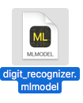
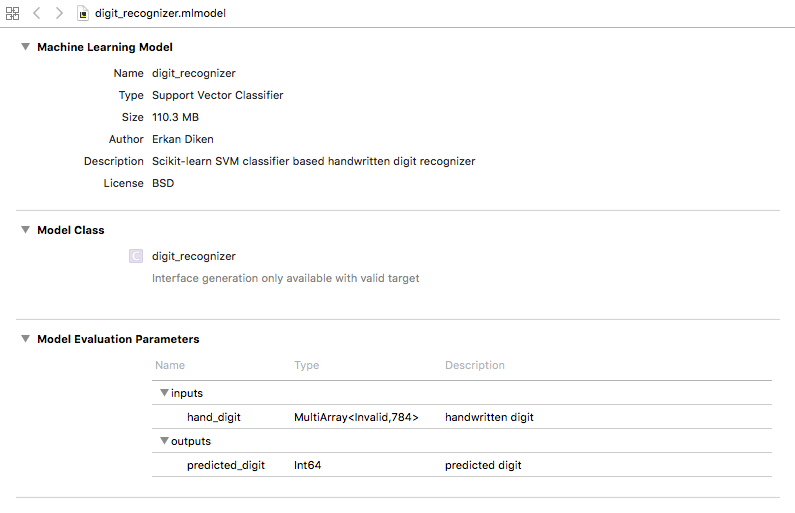

# mnist-scikit-svm-to-coreml

## From a MNIST handwritten digit classifier to Apple's Core ML format

This tutorial goes through:
1) Loading MNIST handwritten image data
2) Training scikit-learn Support Vector Machine (SVM) model with the handwritten digit data
3) Converting scikit-learn SVM model into Apple's Core ML format
4) Loading the coreml model and testing 

## Setting Up Environment

We use coremeltools to convert scikit-learn model to coreml format: https://pypi.python.org/pypi/coremltools

You can use the following commands to create your environment. You just need to replace < projectname > with the name you prefer
for the environment. Pay attention that venv works only with python version 3. I used python 3.6

````
$ python -m venv projectname
$ source projectname/bin/activate
(venv) $ pip install  jupyter
(venv) $ pip install ipykernel
(venv) $ ipython kernel install --user --name=projectname
(venv) $ pip install -r requirements.txt
````

To update coremltools:

````
pip install -U coremltools
````

Now you can launch jupyter notebook to go through the notebook.

````
jupyter-notebook 
````

After you have done with running jupyter notebook, you can deactivate the environment:

````
deactivate
````
## Core ML format
If you have Xcode 9 installed on your system, you can see that "digit_recognizer.mlmodel" is recognized and market 
with the following icon. 


 
You can drag and drop the following model in a Xcode project to include and use the model in your app. Or directly 
click on the open to see the model specs:



## Notes

1. coremltools install command gave an error in the first try; however, running the command second time
fixed the issue.

2. When trying to convert scikit-learn svm model to core ml model, you might get the following error:
 
````
RuntimeError: Got non-zero exit code 72 from xcrun. Output was: xcrun: error: unable to find utility "coremlcompiler", not a developer tool or in PATH
````

In order to fix it, you need to install Xcode 9 (beta) from Apple developer site and and set the path:

````
xcode-select --print-path (check the version of xcode currently used)
sudo xcode-select --switch /Applications/Xcode-beta.app/Contents/Developer (set the path to xcode-beta)
````
